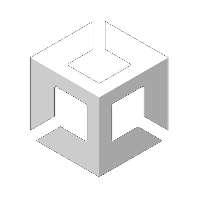

# Hi there, I'm Brennen. 👋 

## I'm a Unity Developer gone Backend Developer
I'm a Unity developer always looking to improve my skills and learn new things, and after having explored backend development that is what I focus on now. I know C# with Unity skills, I've also learned Go, Rust, Typescript and Flutter. 
I've really been interested in tooling lately, as well as trying to get better at understanding the lower level of how computers function.
Things that I'm interested in are cats, anime and manga, good animations and art, and listening to new kinds of music. 

### Connect with me:

&nbsp;&nbsp;

&nbsp;&nbsp;

### Languages and Tools:

 

---

### 📕 Latest Medium Articles

<!-- BLOG-POST-LIST:START -->
- [Upgrading to the Universal Render Pipeline](https://bwitzen.medium.com/upgrading-to-the-universal-render-pipeline-urp-5ff5087f867b)
- [Pushing a box](https://bwitzen.medium.com/pushing-a-box-fcda65d92c2b)
<!-- BLOG-POST-LIST:END -->

➡️ [more medium articles...](https://bwitzen.medium.com)

---

[website]: https://brennenwitzens.intensive.gamedevhq.com
[linkedin]: https://www.linkedin.com/in/brennen-witzens-42412a1ab
